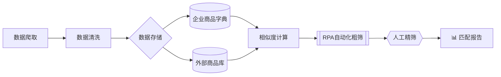
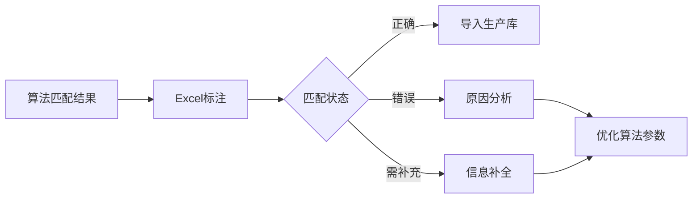

# 2025-商品标题匹配度分析项目  

[](https://github.com/yourusername/2025-ProductTitleMatchingAnalysis)  
暑期实习期间开发的商品标题匹配度分析工具，通过爬取全网商品参数并与企业内部商品字典对比，结合**实在智能RPA自动化工具**与**文本相似度算法**，实现商品标题的高效匹配筛选。最终输出高匹配度产品对，辅助业务部门完成商品信息整合与竞品分析。

---

## 📊 项目背景与价值  

**业务痛点**  
企业需将外部爬取的商品数据与内部商品字典进行匹配，传统人工比对效率低（4小时/万条）、耗时长、准确率波动大（60%-80%）。

**解决方案**  
采用**自动化粗筛+人工精筛**的两层筛选机制：  
1. 算法层：双引擎文本相似度计算（精准匹配+轻量粗筛）  
2. 工具层：实在智能RPA自动化处理  
3. 人工层：Excel交互式审核界面  

---

## 🔧 技术架构  



---

##  核心功能  

### 🔍 1. 数据获取与预处理  
| 组件 | 功能描述 | 技术实现 |
|------|----------|----------|
| 实在智能RPA | 全网商品参数采集 | RPA机器人爬取 |
| 数据清洗 | 品牌/型号/规格标准化 | 正则表达式 + 同义词库 |
| 存储方案 | 异构数据统一管理 | CSV + SQL Server |

### ⚙️ 2. 双算法匹配引擎  
#### 🎯 Method A：精准匹配（有监督）  
```python
def calculate_similarity(features1, features2):
    # 特征权重：品牌40% > 型号35% > 规格15% > 关键词10%
    total_sim = (weights["brand"] * brand_sim +
                 weights["model"] * model_sim +
                 weights["specs"] * spec_sim)
    
    # 关键特征保底机制
    if brand_sim > 0.8 and model_sim > 0.7:
        return max(total_sim, 0.8)  # 确保高质量匹配
```

#### ⚡ Method B：轻量粗筛（无监督）  
```python
def adaptive_weights(metrics):
    # 动态权重分配：字符15% + 词袋20% + 数字15% + 语序15% + 语义35%
    adjustments = [min(1.0, metric*1.5) for metric in metrics]
    return normalize([w*a for w,a in zip(BASE_WEIGHTS, adjustments)])
```

### 🤖 3. RPA自动化流程  
| 阶段 | 输入 | 输出 | 耗时 |
|------|------|------|------|
| 数据加载 | 100万商品对 | - | 8min |
| 阈值过滤 | 相似度>0.7 | 30万候选对 | 15min |
| 结果导出 | 候选商品对 | Excel审核表 | 25min |

### 👩‍💻 4. 人工审核优化  


---

## 🗂️ 项目结构  

```
2025-ProductTitleMatchingAnalysis/
├── 商品名称表2/              # 数据存储
├── code/
│   ├── Method A       # 方法A
│   ├── Method B       # 方法B
```

---

> **最后更新**：2025-07-07  

