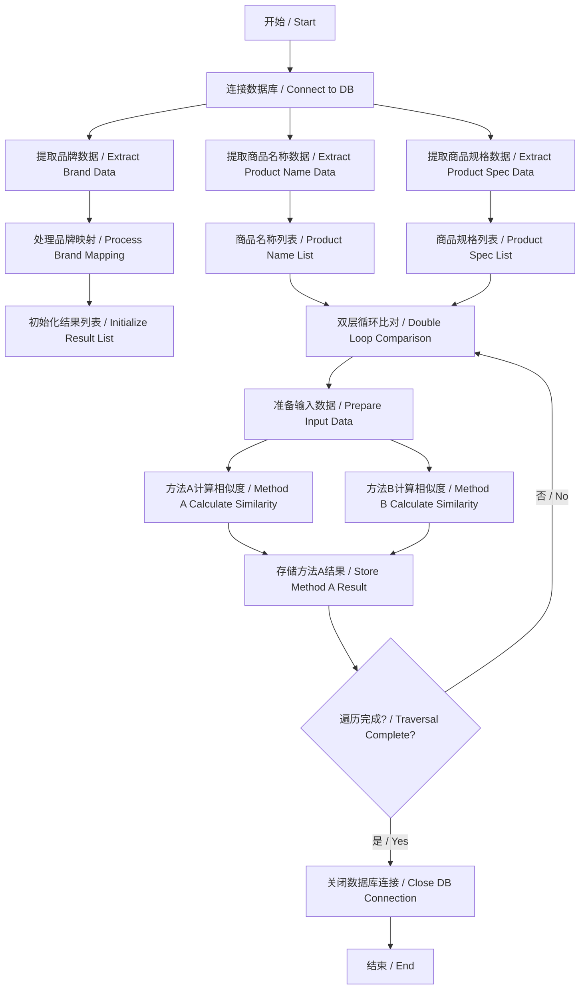
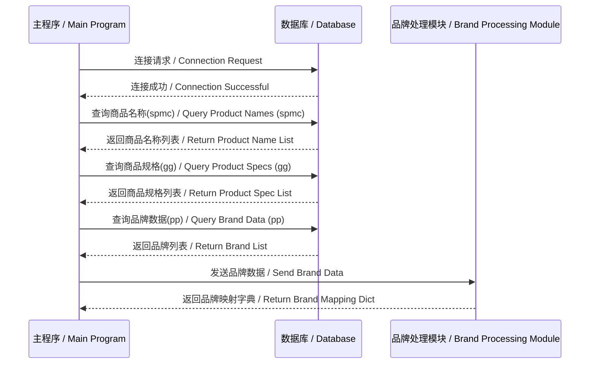
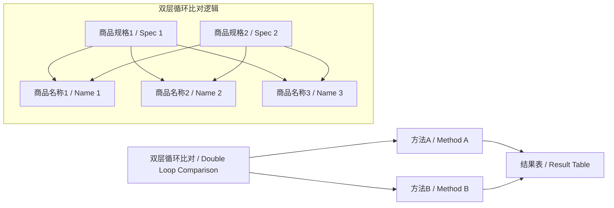
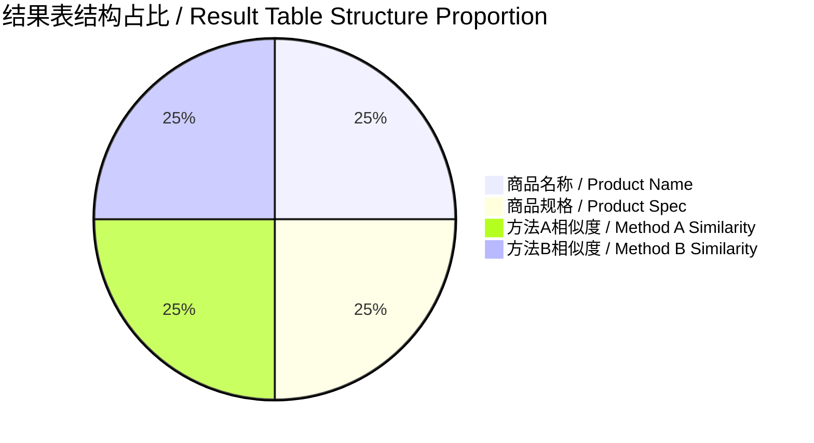
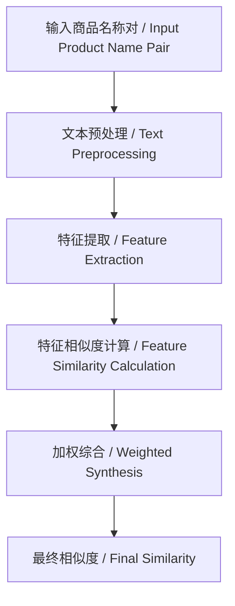
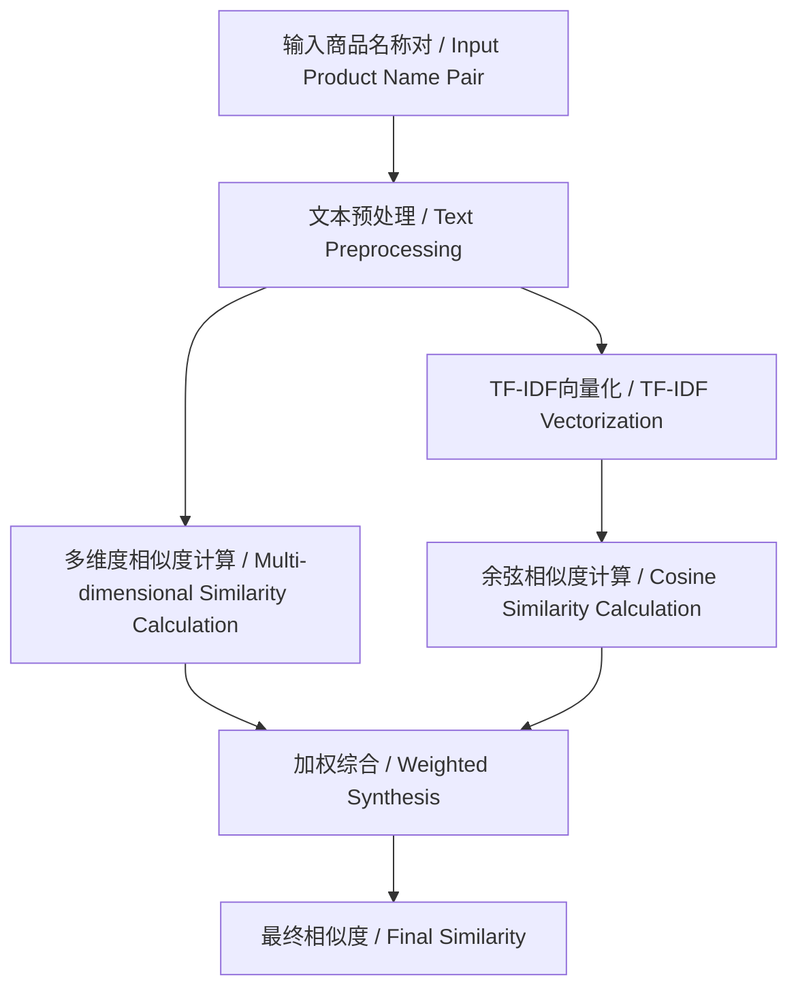
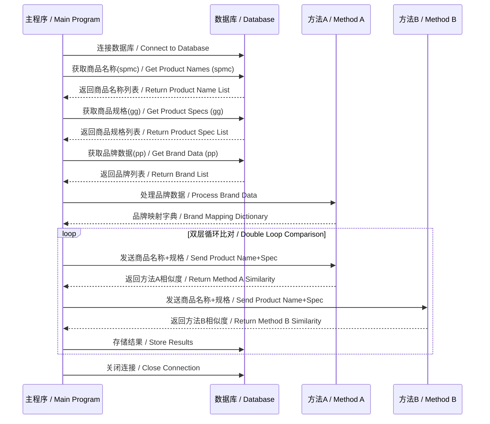
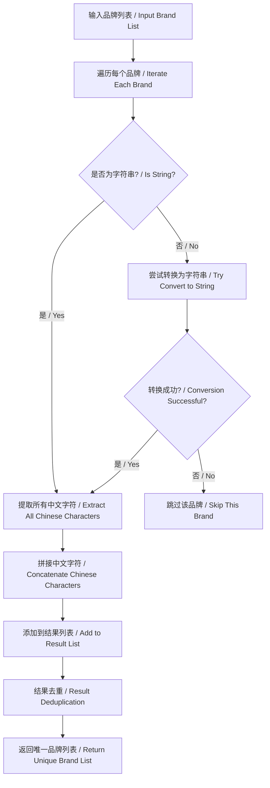
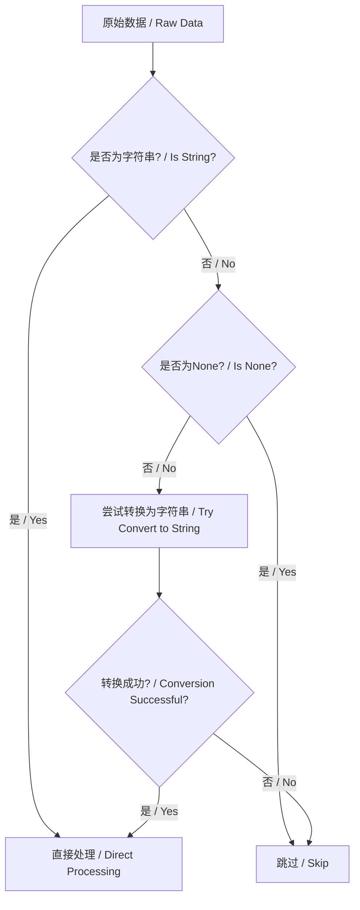
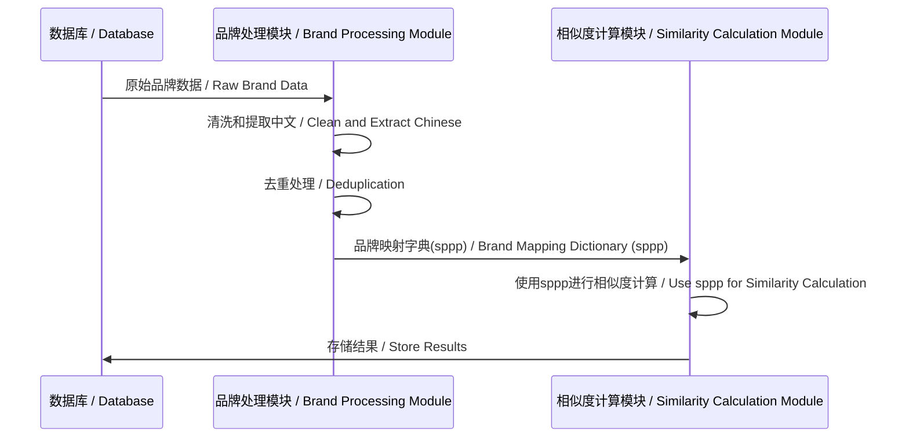

# 商品相似度计算系统 / Product Similarity Calculation System

## 系统概述 / System Overview
本系统实现了从两个数据库表中提取商品数据，通过双层循环比对计算商品相似度，并将结果存储到新表中的完整流程。系统采用双算法并行计算，确保结果准确性和可靠性。

This system implements a complete process of extracting product data from two database tables, calculating product similarity through a double-layer loop comparison, and storing the results in a new table. The system employs dual-algorithm parallel computation to ensure the accuracy and reliability of the results.

## 核心处理流程 / Core Processing Flow



## 数据处理流程详解 / Data Processing Flow Details

### 1. 数据提取阶段 / Data Extraction Phase



### 2. 相似度计算阶段 / Similarity Calculation Phase



### 3. 结果存储阶段 / Result Storage Phase



## 核心算法实现 / Core Algorithm Implementation

# 商品相似度计算系统文档 / Product Similarity Calculation System Documentation

## 方法A：基于特征提取的相似度计算 / Method A: Feature Extraction-Based Similarity Calculation

### 核心算法流程图 / Core Algorithm Flowchart



### 关键功能实现 / Key Function Implementation

```python
def calculate_similarity(input_data, config_path=None, debug=False, sppp=None):
    """
    商品名称相似度计算主函数 / Main function for product name similarity calculation
    基于特征提取和加权计算的相似度算法 / Similarity algorithm based on feature extraction and weighted calculation
    
    参数 / Parameters:
        input_data: 包含两个商品信息的列表 / List containing two product information items
        sppp: 品牌映射字典 / Brand mapping dictionary
        
    返回 / Returns:
        相似度分数 (0-1之间的浮点数) / Similarity score (float between 0-1)
    """
    try:
        # 初始化计算器（传入sppp）/ Initialize calculator (pass sppp)
        calculator = ProductSimilarityCalculator(config_path, debug, sppp)
        
        # 处理输入数据（确保为一对文本）/ Process input data (ensure it's a pair of texts)
        if isinstance(input_data, list) and len(input_data) == 2:
            str1 = str(input_data[0]).strip() if input_data[0] is not None else ""
            str2 = str(input_data[1]).strip() if input_data[1] is not None else ""
        else:
            raise TypeError("输入数据必须是包含两个文本的列表 / Input data must be a list containing two texts")
        
        # 计算单对文本的相似度 / Calculate similarity for a single pair of texts
        similarity = calculator.calculate_pair_similarity(str1, str2)
        return similarity
    
    except Exception as e:
        return 0.0

class ProductSimilarityCalculator:
    def preprocess_text(self, text):
        """文本预处理 / Text Preprocessing"""
        # 转换为小写并去除首尾空格 / Convert to lowercase and remove leading/trailing spaces
        text = text.lower().strip()
        
        # 统一特殊字符 / Unify special characters
        text = re.sub(r'[*/×x&（）【】、，。！？；："「」"''\-_]', ' ', text)
        
        # 品牌缩写替换 / Brand abbreviation replacement
        for abbr, brand in self.brand_mapping.items():
            text = re.sub(rf'\b{re.escape(abbr)}\b', brand.lower(), text)
        
        # 同义词替换 / Synonym replacement
        for syn, words in self.synonyms.items():
            for word in words:
                text = re.sub(rf'\b{re.escape(word.lower())}\b', syn.lower(), text)
        
        # 数字单位标准化 / Digital unit standardization
        text = re.sub(r'(\d+)\s*(gb|g)\b', r'\1gb', text)
        text = re.sub(r'(\d+)\s*(ml|毫升)\b', r'\1ml', text)
        # ...其他单位标准化 / ...Other unit standardization
        
        # 移除停用词 / Remove stop words
        for word in self.stop_words:
            text = re.sub(rf'\b{re.escape(word)}\b', '', text)
        
        # 合并多个空格 / Merge multiple spaces
        return re.sub(r'\s+', ' ', text).strip()
    
    def extract_features(self, text):
        """提取文本特征 / Extract Text Features"""
        brand = self._extract_brand(text)
        model = self._extract_model(text, brand)
        
        features = {
            "brand": brand,
            "model": model,
            "specs": self._extract_specs(text),
            "keywords": self._extract_keywords(text, brand, model),
            "digits": ''.join(re.findall(r'\d+', text)),
            "color": self._extract_color(text)
        }
        return features
    
    def calculate_feature_similarity(self, features1, features2):
        """计算特征相似度 / Calculate Feature Similarity"""
        # 计算各特征维度相似度 / Calculate similarity for each feature dimension
        brand_sim = self._calculate_brand_similarity(features1["brand"], features2["brand"])
        model_sim = self._calculate_model_similarity(features1["model"], features2["model"])
        spec_sim = self._calculate_spec_similarity(features1["specs"], features2["specs"])
        keyword_sim = self._calculate_keyword_similarity(features1["keywords"], features2["keywords"])
        digit_sim = self._calculate_digit_similarity(features1["digits"], features2["digits"])
        color_sim = self._calculate_color_similarity(features1["color"], features2["color"])
        
        # 加权综合 / Weighted synthesis
        weights = self.feature_weights
        total_sim = (
            weights["brand"] * brand_sim +
            weights["model"] * model_sim +
            weights["specs"] * spec_sim +
            weights["keywords"] * keyword_sim +
            weights["digits"] * digit_sim +
            weights["color"] * color_sim
        )
        
        # 应用提升规则 / Apply enhancement rules
        if brand_sim > 0.8 and model_sim > 0.7:
            total_sim = max(total_sim, self.min_similarity.get("model_match", 0.8))
        elif brand_sim > 0.8:
            total_sim = max(total_sim, self.min_similarity.get("brand_match", 0.7))
        
        return min(max(total_sim, 0.0), 1.0)
```

## 方法B：基于混合模型的相似度计算 / Method B: Hybrid Model-Based Similarity Calculation

### 核心算法流程图 / Core Algorithm Flowchart



### 关键功能实现 / Key Function Implementation

```python
def calculate_similarities(input_data):
    """
    商品相似度计算方法B / Product Similarity Calculation Method B
    基于TF-IDF和多维度相似度计算的混合算法 / Hybrid algorithm based on TF-IDF and multi-dimensional similarity calculation
    
    参数 / Parameters:
        input_data: 包含两个商品信息的列表 / List containing two product information items
        
    返回 / Returns:
        相似度分数 (0-1之间的浮点数) / Similarity score (float between 0-1)
    """
    # 输入格式校验与标准化 / Input format validation and standardization
    if isinstance(input_data, (list, tuple)) and len(input_data) == 2:
        title_pairs = [input_data]
    else:
        raise TypeError("输入必须是单个二元组或二元组列表 / Input must be a single tuple or list of tuples")
    
    # 提取所有标题构建语料库 / Extract all titles to build a corpus
    all_titles = []
    for t1, t2 in title_pairs:
        processed_t1 = preprocess_text(t1) if t1 is not None else ""
        processed_t2 = preprocess_text(t2) if t2 is not None else ""
        all_titles.append(processed_t1)
        all_titles.append(processed_t2)
    
    # 创建TF-IDF向量化器 / Create TF-IDF vectorizer
    vectorizer = TfidfVectorizer(tokenizer=lambda x: x.split(), token_pattern=None)
    tfidf_matrix = vectorizer.fit_transform(all_titles)
    
    preprocessed = [
        (preprocess_text(t1) if t1 is not None else "", 
         preprocess_text(t2) if t2 is not None else "") 
        for t1, t2 in title_pairs
    ]
    results = []
    
    for i, (t1, t2) in enumerate(preprocessed):
        # 计算TF-IDF余弦相似度 / Calculate TF-IDF cosine similarity
        idx1 = i * 2
        idx2 = i * 2 + 1
        tfidf_sim = cosine_similarity(tfidf_matrix[idx1], tfidf_matrix[idx2])[0][0]
        
        # 计算其他相似度 / Calculate other similarities
        other_sim = compute_similarity(t1, t2)
        
        # 调整权重：TF-IDF占20%，其他方法占80% / Adjust weights: TF-IDF 20%, other methods 80%
        final_sim = 0.2 * tfidf_sim + 0.8 * other_sim
        results.append(round(final_sim, 4))
    
    return results[0] if results else 0.0

def compute_similarity(t1, t2):
    """智能相似度计算引擎 / Intelligent Similarity Calculation Engine"""
    # 核心相似度维度 / Core similarity dimensions
    char_sim = character_similarity(t1, t2)
    token_sim = token_similarity(t1, t2)
    num_sim = numeric_similarity(t1, t2)
    order_sim = order_similarity(t1, t2)
    semantic_sim = semantic_analysis(t1, t2)
    
    # 动态权重分配 / Dynamic weight allocation
    metrics = [char_sim, token_sim, num_sim, order_sim, semantic_sim]
    weights = adaptive_weights(metrics)
    
    # 加权综合 / Weighted synthesis
    final_sim = sum(w * m for w, m in zip(weights, metrics))
    return max(0.0, min(1.0, final_sim))

def semantic_analysis(text1, text2):
    """动态语义分析 / Dynamic Semantic Analysis"""
    # 1. 关键特征差异检测 / Key feature difference detection
    diff_features = detect_feature_differences(text1, text2)
    if diff_features > 3:  # 多个关键特征不同 / Multiple key features differ
        return max(0.1, 0.7 - diff_features * 0.1)
    
    # 2. 型号一致性检测 / Model consistency detection
    model_match = detect_model_consistency(text1, text2)
    if not model_match:
        return 0.4
    
    # 3. 属性差异评估 / Attribute difference evaluation
    return evaluate_attribute_differences(text1, text2)
```

## 系统集成流程 / System Integration Flow

### 数据处理流程图 / Data Processing Flowchart



### 核心集成代码 / Core Integration Code

```python
# 数据库连接配置 / Database Connection Configuration
db_config = [
    {"name": "DataSource", "value": "192.168.99.179"},
    {"name": "DbName", "value": "pricedb"},
    {"name": "Port", "value": 9826},
    {"name": "UserName", "value": "sa"},
    {"name": "Pwd", "value": "U2VydmVyY2YxZThj"}
]

数据库对象 = Database.DBConnect(SZEnv['rpa'], 1, db_config)

try:
    # 从数据库获取数据 / Get data from database
    spmc = Database.SingleSQLQuery(SZEnv['rpa'], 数据库对象, "SELECT TOP 13 spmc FROM cj_spzd")
    spxx = Database.SingleSQLQuery(SZEnv['rpa'], 数据库对象, "SELECT TOP 6 gg FROM cj_rw_spxx")
    brand = Database.SingleSQLQuery(SZEnv['rpa'], 数据库对象, "SELECT pp FROM cj_spzd")
    
    # 处理品牌映射 / Process brand mapping
    brand_list = Basic.SetVariable(SZEnv['rpa'], brand, var_ret=1)
    sppp = run_module("code_modules.获取品牌名称", "main", brand_list)
    
    # 双层循环比对 / Double loop comparison
    for 当前spxx in spxx:
        for 当前spmc in spmc:
            # 准备输入数据 / Prepare input data
            input_data = [当前spmc, 当前spxx]
            
            # 调用方法A计算相似度 / Call Method A to calculate similarity
            result_a = calculate_similarity(input_data, sppp=sppp)
            
            # 调用方法B计算相似度 / Call Method B to calculate similarity
            result_b = calculate_similarities(input_data)
            
            # 存储结果到数据库 / Store results to database
            Database.SQLExecute(
                SZEnv['rpa'], 
                数据库对象, 
                "INSERT INTO cj_sppp (spmc, gg, similarity_a, similarity_b) VALUES (?, ?, ?, ?)", 
                [当前spmc, 当前spxx, result_a, result_b]
            )
            
except Exception as ex:
    # 异常处理 / Exception handling
    Basic.DebugOutput(SZEnv['rpa'], SZEnv['rpa'].format_ex(ex))
finally:
    # 关闭数据库连接 / Close database connection
    Database.CloseDBConnect(SZEnv['rpa'], 数据库对象)
```

# 品牌名称提取模块文档 / Brand Name Extraction Module Documentation

## 功能概述 / Function Overview
这个模块负责从原始品牌数据中提取标准化的中文品牌名称，并进行去重处理。它专门用于处理包含特殊字符、英文或混合文本的品牌数据，提取出纯净的中文品牌名称。

This module is responsible for extracting standardized Chinese brand names from raw brand data and performing deduplication. It is specifically designed to process brand data containing special characters, English, or mixed text, extracting pure Chinese brand names.

## 核心算法流程图 / Core Algorithm Flowchart



## 关键功能实现 / Key Function Implementation

```python
import re

def main(input_list):
    """清洗并提取品牌名称的核心方法 / Core method for cleaning and extracting brand names
    
    参数 / Parameters:
        input_list: 原始品牌数据列表，可能包含字符串、None或其他类型 / Raw brand data list, may contain strings, None, or other types
        
    返回 / Returns:
        去重后的中文品牌名称列表 / Deduplicated Chinese brand name list
    """
    # 初始化结果列表 / Initialize result list
    cleaned_brands = []
    
    # 遍历输入列表中的每个品牌 / Iterate each brand in the input list
    for brand in input_list:
        # 处理非字符串类型 / Handle non-string types
        if not isinstance(brand, str):
            if brand is None:
                continue
            try:
                brand = str(brand)
            except:
                continue
        
        # 使用正则表达式提取所有中文字符 / Use regex to extract all Chinese characters
        chinese_chars = re.findall(r'[\u4e00-\u9fff]+', brand)
        
        # 如果找到汉字部分，拼接成字符串 / If Chinese characters found, concatenate into string
        if chinese_chars:
            brand_name = ''.join(chinese_chars)
            cleaned_brands.append(brand_name)
    
    # 去重处理（保留原始顺序）/ Deduplication (preserve original order)
    seen = set()
    unique_brands = []
    for brand in cleaned_brands:
        if brand not in seen:
            seen.add(brand)
            unique_brands.append(brand)
    
    return unique_brands
```

## 处理流程详解 / Processing Flow Details

### 1. 输入处理 / Input Processing
- 接受原始品牌数据列表 / Accept raw brand data list
- 列表元素可能是各种类型（字符串、None、数字等）/ List elements may be of various types (strings, None, numbers, etc.)

### 2. 数据类型处理 / Data Type Processing


### 3. 中文提取 / Chinese Extraction
- 使用正则表达式 `[\u4e00-\u9fff]+` 匹配所有中文字符 / Use regex `[\u4e00-\u9fff]+` to match all Chinese characters
- 提取结果可能是多个不连续的中文片段 / Extraction result may be multiple discontinuous Chinese fragments
- 将提取的中文片段拼接成完整字符串 / Concatenate extracted Chinese fragments into complete strings

### 4. 结果去重 / Result Deduplication
- 使用集合(Set)检测重复项 / Use Set to detect duplicates
- 保留原始顺序的独特品牌列表 / Unique brand list preserving original order
- 确保结果中每个品牌名称只出现一次 / Ensure each brand name appears only once in the result

## 使用示例 / Usage Example

### 输入数据 / Input Data
```python
raw_brands = [
    "Nike-耐克",
    "Adidas阿迪达斯",
    "Apple苹果",
    None,
    12345,
    "华为/HUAWEI",
    "小米科技",
    "三星电子-Samsung",
    "格力-GREE"
]
```

### 处理过程 / Processing
```python
cleaned = main(raw_brands)
```

### 输出结果 / Output Result
```
['耐克', '阿迪达斯', '苹果', '华为', '小米科技', '三星电子', '格力']
```

## 集成到主流程 / Integration into Main Flow

### 在商品相似度系统中的调用 / Call in Product Similarity System
```python
# 从数据库获取原始品牌数据 / Get raw brand data from database
brand_data = Database.SingleSQLQuery(SZEnv['rpa'], 数据库对象, "SELECT pp FROM cj_spzd")

# 处理品牌数据 / Process brand data
cleaned_brands = main(brand_data)

# 构建品牌映射字典 / Build brand mapping dictionary
sppp = {brand: brand for brand in cleaned_brands}

# 将品牌映射传递给相似度计算方法 / Pass brand mapping to similarity calculation method
result = calculate_similarity(input_data, sppp=sppp)
```

### 数据处理流程图 / Data Processing Flowchart


## 处理规则说明 / Processing Rules Description

| 输入类型 / Input Type | 处理方式 / Processing Method | 示例输入 / Example Input | 示例输出 / Example Output |
|----------|----------|----------|----------|
| 纯中文 / Pure Chinese | 直接提取 / Direct Extraction | "华为手机" | "华为手机" |
| 中英混合 / Chinese-English Mixed | 提取中文部分 / Extract Chinese Part | "Apple苹果" | "苹果" |
| 带特殊字符 / With Special Characters | 提取中文部分 / Extract Chinese Part | "三星/Samsung" | "三星" |
| None值 / None Value | 跳过处理 / Skip Processing | None | (不包含 / Not Included) |
| 数字 / Numbers | 跳过处理 / Skip Processing | 12345 | (不包含 / Not Included) |
| 无中文 / No Chinese | 跳过处理 / Skip Processing | "Samsung" | (不包含 / Not Included) |

## 应用场景 / Application Scenarios

1. **电商数据清洗**：从商品信息中提取纯净品牌名称 / **E-commerce Data Cleaning**: Extract pure brand names from product information
2. **品牌分析**：统计不同品牌的出现频率 / **Brand Analysis**: Count occurrence frequency of different brands
3. **数据标准化**：为不同来源的品牌数据提供统一格式 / **Data Standardization**: Provide unified format for brand data from different sources
4. **相似度计算**：为商品相似度算法提供标准化的品牌输入 / **Similarity Calculation**: Provide standardized brand input for product similarity algorithms

## 性能优化 / Performance Optimization

- **高效正则**：使用预编译正则表达式提高匹配效率 / **Efficient Regex**: Use precompiled regex to improve matching efficiency
- **惰性处理**：只在必要时进行类型转换 / **Lazy Processing**: Perform type conversion only when necessary
- **集合去重**：O(1)时间复杂度的重复检测 / **Set Deduplication**: O(1) time complexity duplicate detection
- **短路逻辑**：遇到无效数据立即跳过 / **Short-circuit Logic**: Skip invalid data immediately

## 总流程结果表示例 / Overall Process Result Table Example

| 商品名称 / Product Name | 商品规格 / Product Spec | 方法A相似度 / Method A Similarity | 方法B相似度 / Method B Similarity |
|---------------|-------------|------------|------------|
| iPhone 13 Pro | 128GB 银色 / Silver | 0.92 | 0.87 |
| 华为 Mate 50 / Huawei Mate 50 | 256GB 黑色 / Black | 0.85 | 0.82 |
| 小米 12 Ultra / Xiaomi 12 Ultra | 512GB 蓝色 / Blue | 0.78 | 0.76 |
| 三星 Galaxy S22 / Samsung Galaxy S22 | 128GB 白色 / White | 0.91 | 0.88 |
| iPad Pro 2022 | 256GB 灰色 / Gray | 0.83 | 0.79 |

## 系统优势对比 / System Advantage Comparison

| 特性 / Feature | 方法A / Method A | 方法B / Method B |
|------|-------|-------|
| 核心算法 / Core Algorithm | 基于规则的特征提取 / Rule-based Feature Extraction | 混合模型(TF-IDF+语义) / Hybrid Model (TF-IDF+Semantic) |
| 处理速度 / Processing Speed | ⚡ 快速 / Fast | ⏳ 中等 / Medium |
| 准确性 / Accuracy | 高（结构化数据）/ High (Structured Data) | 非常高（复杂场景）/ Very High (Complex Scenarios) |
| 适用场景 / Applicable Scenario | 标准化商品名称 / Standardized Product Names | 非结构化商品描述 / Unstructured Product Descriptions |
| 可解释性 / Interpretability | ✅ 高 / High | ⚠️ 中等 / Medium |
| 品牌依赖 / Brand Dependency | ✅ 强依赖 / Strong Dependency | ⚠️ 弱依赖 / Weak Dependency |
| 计算复杂度 / Computational Complexity | 中 / Medium | 高 / High |

## 使用指南 / Usage Guide

1. **配置数据库连接** / **Configure Database Connection**：
   ```python
   # 配置数据库连接参数 / Configure database connection parameters
   db_config = [
       {"name": "DataSource", "value": "192.168.99.179"},
       {"name": "DbName", "value": "pricedb"},
       {"name": "Port", "value": 9826},
       {"name": "UserName", "value": "sa"},
       {"name": "Pwd", "value": "U2VydmVyY2YxZThj"}
   ]
   
   数据库对象 = Database.DBConnect(SZEnv['rpa'], 1, db_config)
   ```

2. **执行相似度计算** / **Execute Similarity Calculation**：
   ```python
   # 双层循环比对 / Double loop comparison
   for spec in product_specs:
       for name in product_names:
           input_data = [name, spec]
           result_a = calculate_similarity(input_data, sppp=brand_mapping)
           result_b = calculate_similarities(input_data)
           save_results(name, spec, result_a, result_b)
   ```

3. **结果分析** / **Result Analysis**：
   ```sql
   -- 查询高相似度商品对 / Query high similarity product pairs
   SELECT * FROM cj_sppp 
   WHERE similarity_a > 0.8 
      OR similarity_b > 0.8
   ORDER BY similarity_a DESC;
   ```

4. **优化建议** / **Optimization Suggestions**：
   - 对于大批量数据处理，考虑分批处理 / For large-scale data processing, consider batch processing
   - 定期更新品牌映射词典 / Regularly update brand mapping dictionary
   - 对方法B使用GPU加速 / Use GPU acceleration for Method B
   - 为高频查询建立结果缓存 / Establish result cache for high-frequency queries

## 技术支持 / Technical Support

**联系信息** / **Contact Information**：  
📧 smytz6@163.com  

**最后更新** / **Last Updated**：2025-8-24

---
