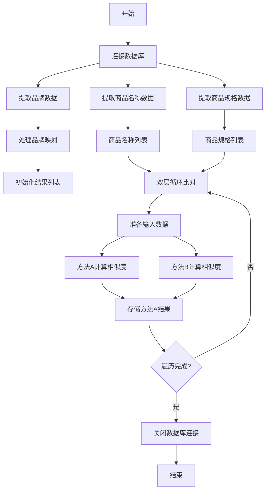
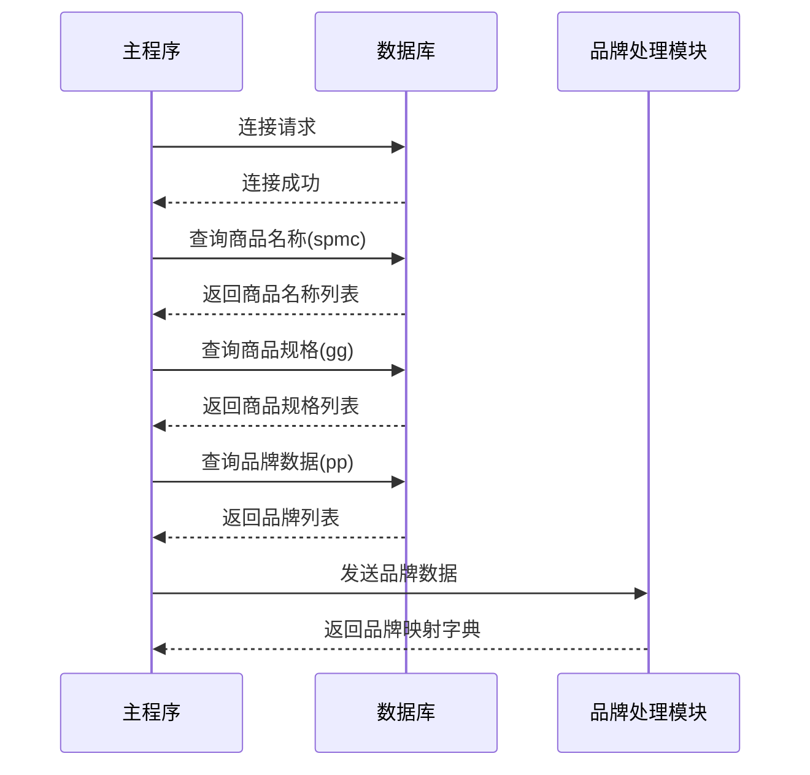
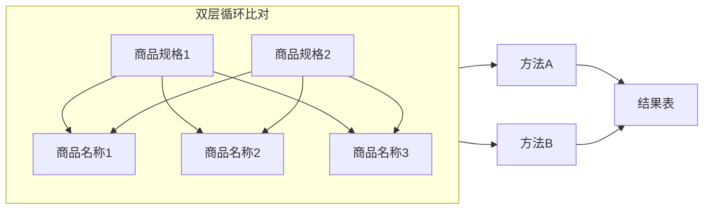
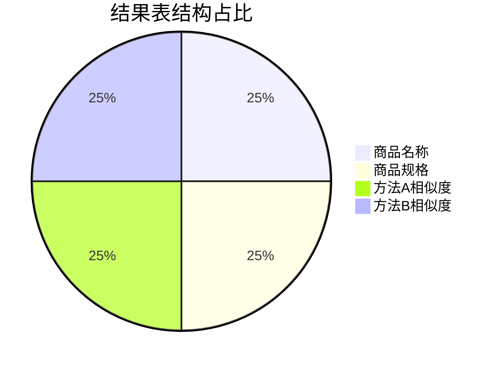
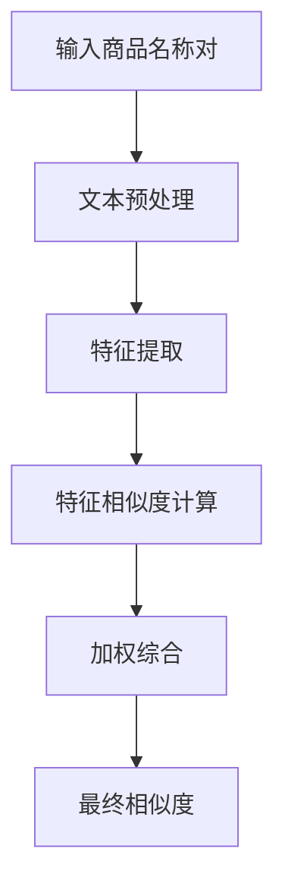
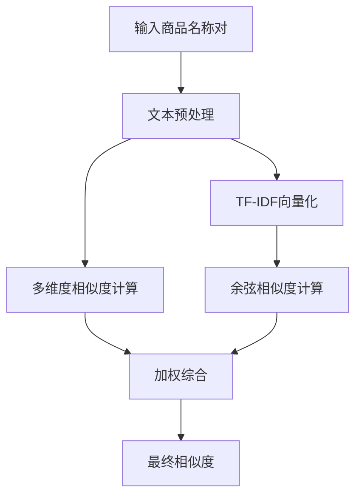
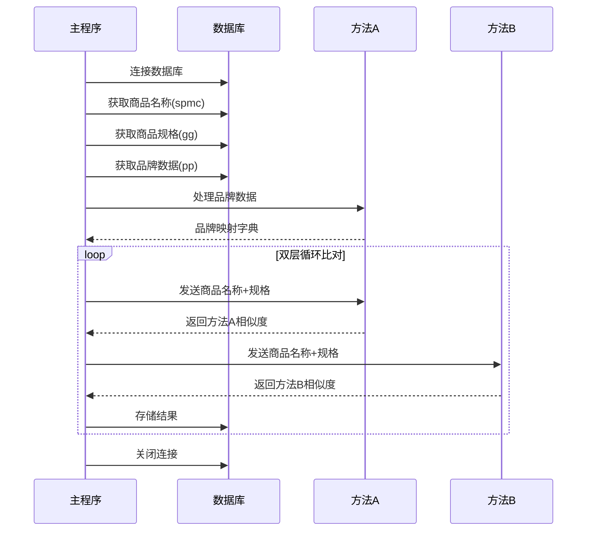

# 2025-标题匹配度分析项目  

暑期实习期间开发的商品标题匹配度分析工具，通过爬取商品参数并与企业内部商品字典对比，结合**实在智能RPA自动化工具**与**文本相似度算法**，实现商品标题的高效匹配筛选。最终输出高匹配度产品对，辅助业务部门完成商品信息整合与竞品分析。

---
# 商品相似度计算系统

## 系统概述
本系统实现了从两个数据库表中提取商品数据，通过双层循环比对计算商品相似度，并将结果存储到新表中的完整流程。系统采用双算法并行计算，确保结果准确性和可靠性。


## 核心处理流程



## 数据处理流程详解

### 1. 数据提取阶段



### 2. 相似度计算阶段



### 3. 结果存储阶段



## 核心算法实现

# 商品相似度计算系统文档

## 方法A：基于特征提取的相似度计算

### 核心算法流程图



### 关键功能实现

```python
def calculate_similarity(input_data, config_path=None, debug=False, sppp=None):
    """
    商品名称相似度计算主函数
    基于特征提取和加权计算的相似度算法
    
    参数:
        input_data: 包含两个商品信息的列表
        sppp: 品牌映射字典
        
    返回:
        相似度分数 (0-1之间的浮点数)
    """
    try:
        # 初始化计算器（传入sppp）
        calculator = ProductSimilarityCalculator(config_path, debug, sppp)
        
        # 处理输入数据（确保为一对文本）
        if isinstance(input_data, list) and len(input_data) == 2:
            str1 = str(input_data[0]).strip() if input_data[0] is not None else ""
            str2 = str(input_data[1]).strip() if input_data[1] is not None else ""
        else:
            raise TypeError("输入数据必须是包含两个文本的列表")
        
        # 计算单对文本的相似度
        similarity = calculator._calculate_pair_similarity(str1, str2)
        return similarity
    
    except Exception as e:
        return 0.0

class ProductSimilarityCalculator:
    def preprocess_text(self, text):
        """文本预处理"""
        # 转换为小写并去除首尾空格
        text = text.lower().strip()
        
        # 统一特殊字符
        text = re.sub(r'[*/×x&（）【】、，。！？；："“”‘’\-_]', ' ', text)
        
        # 品牌缩写替换
        for abbr, brand in self.brand_mapping.items():
            text = re.sub(rf'\b{re.escape(abbr)}\b', brand.lower(), text)
        
        # 同义词替换
        for syn, words in self.synonyms.items():
            for word in words:
                text = re.sub(rf'\b{re.escape(word.lower())}\b', syn.lower(), text)
        
        # 数字单位标准化
        text = re.sub(r'(\d+)\s*(gb|g)\b', r'\1gb', text)
        text = re.sub(r'(\d+)\s*(ml|毫升)\b', r'\1ml', text)
        # ...其他单位标准化
        
        # 移除停用词
        for word in self.stop_words:
            text = re.sub(rf'\b{re.escape(word)}\b', '', text)
        
        # 合并多个空格
        return re.sub(r'\s+', ' ', text).strip()
    
    def extract_features(self, text):
        """提取文本特征"""
        features = {
            "brand": self._extract_brand(text),
            "model": self._extract_model(text, brand),
            "specs": self._extract_specs(text),
            "keywords": self._extract_keywords(text, brand, model),
            "digits": ''.join(re.findall(r'\d+', text)),
            "color": self._extract_color(text)
        }
        return features
    
    def calculate_feature_similarity(self, features1, features2):
        """计算特征相似度"""
        # 计算各特征维度相似度
        brand_sim = self._calculate_brand_similarity(features1["brand"], features2["brand"])
        model_sim = self._calculate_model_similarity(features1["model"], features2["model"])
        # ...其他特征相似度计算
        
        # 加权综合
        weights = self.feature_weights
        total_sim = (
            weights["brand"] * brand_sim +
            weights["model"] * model_sim +
            weights["specs"] * spec_sim +
            weights["keywords"] * keyword_sim +
            weights["digits"] * digit_sim +
            weights["color"] * color_sim
        )
        
        # 应用提升规则
        if brand_sim > 0.8 and model_sim > 0.7:
            total_sim = max(total_sim, self.min_similarity.get("model_match", 0.8))
        elif brand_sim > 0.8:
            total_sim = max(total_sim, self.min_similarity.get("brand_match", 0.7))
        
        return min(max(total_sim, 0.0), 1.0)
```

## 方法B：基于混合模型的相似度计算

### 核心算法流程图



### 关键功能实现

```python
def calculate_similarities(input_data):
    """
    商品相似度计算方法B
    基于TF-IDF和多维度相似度计算的混合算法
    
    参数:
        input_data: 包含两个商品信息的列表
        
    返回:
        相似度分数 (0-1之间的浮点数)
    """
    # 输入格式校验与标准化
    if isinstance(input_data, (list, tuple)) and len(input_data) == 2:
        title_pairs = [input_data]
    else:
        raise TypeError("输入必须是单个二元组或二元组列表")
    
    # 提取所有标题构建语料库
    all_titles = []
    for t1, t2 in title_pairs:
        all_titles.append(preprocess_text(t1))
        all_titles.append(preprocess_text(t2))
    
    # 创建TF-IDF向量化器
    vectorizer = TfidfVectorizer(tokenizer=lambda x: x.split(), token_pattern=None)
    tfidf_matrix = vectorizer.fit_transform(all_titles)
    
    preprocessed = [(preprocess_text(t1), preprocess_text(t2)) for t1, t2 in title_pairs]
    results = []
    
    for i, (t1, t2) in enumerate(preprocessed):
        # 计算TF-IDF余弦相似度
        idx1 = i * 2
        idx2 = i * 2 + 1
        tfidf_sim = cosine_similarity(tfidf_matrix[idx1], tfidf_matrix[idx2])[0][0]
        
        # 计算其他相似度
        other_sim = compute_similarity(t1, t2)
        
        # 调整权重：TF-IDF占20%，其他方法占80%
        final_sim = 0.2 * tfidf_sim + 0.8 * other_sim
        results.append(round(final_sim, 4))
    
    return results[0]

def compute_similarity(t1, t2):
    """智能相似度计算引擎"""
    # 核心相似度维度
    char_sim = character_similarity(t1, t2)
    token_sim = token_similarity(t1, t2)
    num_sim = numeric_similarity(t1, t2)
    order_sim = order_similarity(t1, t2)
    semantic_sim = semantic_analysis(t1, t2)
    
    # 动态权重分配
    metrics = [char_sim, token_sim, num_sim, order_sim, semantic_sim]
    weights = adaptive_weights(metrics)
    
    # 加权综合
    final_sim = sum(w * m for w, m in zip(weights, metrics))
    return max(0.0, min(1.0, final_sim))

def semantic_analysis(text1, text2):
    """动态语义分析"""
    # 1. 关键特征差异检测
    diff_features = detect_feature_differences(text1, text2)
    if diff_features > 3:  # 多个关键特征不同
        return max(0.1, 0.7 - diff_features * 0.1)
    
    # 2. 型号一致性检测
    model_match = detect_model_consistency(text1, text2)
    if not model_match:
        return 0.4
    
    # 3. 属性差异评估
    return evaluate_attribute_differences(text1, text2)
```

## 系统集成流程

### 数据处理流程图



### 核心集成代码

```python
# 数据库连接配置
数据库对象 = Database.DBConnect(SZEnv['rpa'], 1, [
    {"name":"DataSource","value":"192.168.99.179"},
    {"name":"DbName","value":"pricedb"},
    {"name":"Port","value":9826},
    {"name":"UserName","value":"sa"},
    {"name":"Pwd","value":"U2VydmVyY2YxZThj"}
])

try:
    # 从数据库获取数据
    spmc = Database.SingleSQLQuery(SZEnv['rpa'], 数据库对象, "select top 13 spmc from cj_spzd")
    spxx = Database.SingleSQLQuery(SZEnv['rpa'], 数据库对象, "select top 6 gg from cj_rw_spxx")
    brand = Database.SingleSQLQuery(SZEnv['rpa'], 数据库对象, "select pp from cj_spzd")
    
    # 处理品牌映射
    brand_list = Basic.SetVariable(SZEnv['rpa'], brand, var_ret=1)
    sppp = run_module("code_modules.获取品牌名称", "main", brand_list)
    
    # 双层循环比对
    for 当前spxx in spxx:
        for 当前spmc in spmc:
            # 准备输入数据
            input_data = [当前spmc, 当前spxx]
            
            # 调用方法A计算相似度
            result_a = calculate_similarity(input_data, sppp=sppp)
            
            # 调用方法B计算相似度
            result_b = calculate_similarities(input_data)
            
            # 存储结果到数据库
            Database.SQLExecute(
                SZEnv['rpa'], 
                数据库对象, 
                "INSERT INTO cj_sppp VALUES (?, ?, ?, ?)", 
                [当前spmc, 当前spxx, result_a, result_b]
            )
            
except Exception as ex:
    # 异常处理
    Basic.DebugOutput(SZEnv['rpa'], SZEnv['rpa'].format_ex(ex))
finally:
    # 关闭数据库连接
    Database.CloseDBConnect(SZEnv['rpa'], 数据库对象)
```

## 结果表示例

| 商品名称       | 商品规格     | 方法A相似度 | 方法B相似度 |
|---------------|-------------|------------|------------|
| iPhone 13 Pro | 128GB 银色  | 0.92       | 0.87       |
| 华为 Mate 50  | 256GB 黑色  | 0.85       | 0.82       |
| 小米 12 Ultra | 512GB 蓝色  | 0.78       | 0.76       |
| 三星 Galaxy S22 | 128GB 白色 | 0.91       | 0.88       |
| iPad Pro 2022 | 256GB 灰色  | 0.83       | 0.79       |


## 系统优势对比

| 特性 | 方法A | 方法B |
|------|-------|-------|
| 核心算法 | 基于规则的特征提取 | 混合模型(TF-IDF+语义) |
| 处理速度 | ⚡ 快速 | ⏳ 中等 |
| 准确性 | 高（结构化数据） | 非常高（复杂场景） |
| 适用场景 | 标准化商品名称 | 非结构化商品描述 |
| 可解释性 | ✅ 高 | ⚠️ 中等 |
| 品牌依赖 | ✅ 强依赖 | ⚠️ 弱依赖 |
| 计算复杂度 | 中 | 高 |

## 使用指南

1. **配置数据库连接**：
   ```python
   # 配置数据库连接参数
   数据库对象 = Database.DBConnect(
       SZEnv['rpa'], 
       1, 
       [{"name":"DataSource","value":"192.168.99.179"},
        {"name":"DbName","value":"pricedb"},
        {"name":"Port","value":9826},
        {"name":"UserName","value":"sa"},
        {"name":"Pwd","value":"U2VydmVyY2YxZThj"}]
   )
   ```

2. **执行相似度计算**：
   ```python
   # 双层循环比对
   for spec in product_specs:
       for name in product_names:
           input_data = [name, spec]
           result_a = calculate_similarity(input_data, sppp=brand_mapping)
           result_b = calculate_similarities(input_data)
           save_results(name, spec, result_a, result_b)
   ```

3. **结果分析**：
   ```sql
   -- 查询高相似度商品对
   SELECT * FROM cj_sppp 
   WHERE methodA_similarity > 0.8 
      OR methodB_similarity > 0.8
   ORDER BY methodA_similarity DESC;
   ```

4. **优化建议**：
   - 对于大批量数据处理，考虑分批处理
   - 定期更新品牌映射词典
   - 对方法B使用GPU加速
   - 为高频查询建立结果缓存

## 技术支持

**联系信息**：  
📧 smytz6@163.com  

**最后更新**：2025年8月12日
